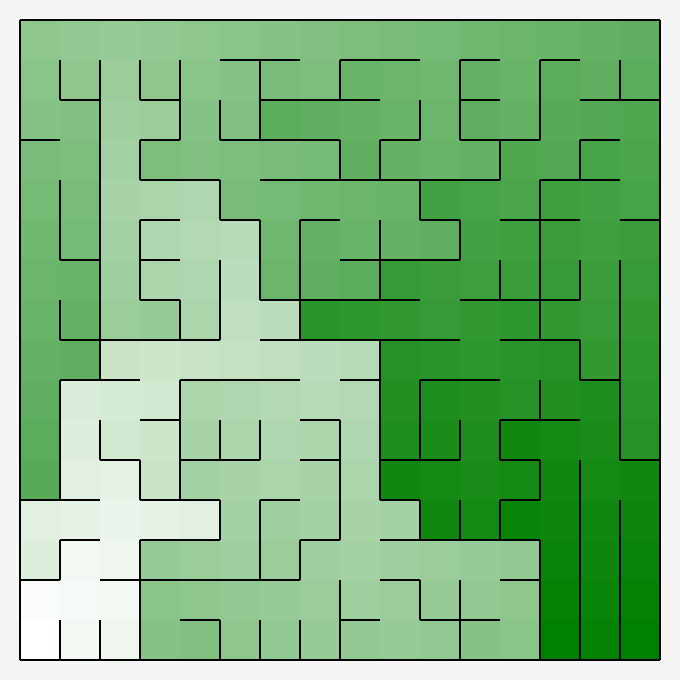

# Project Infinis

A maze generator and solver. Use to experiment with a wide range of algorithms.

## Project Structure

- Apollo Core > _Contains the Infinis source code_
  - Scaffolding > Core structures used to construct mazes
  - Generators > Algorithms used to traverse and generate mazes. Binary Tree and Sidewinder algorithms, for example.

- Apollo.Tests > _Contains all the unit tests for Infinis_

### Colour Mazes
Each of the below shows the distance of each cell from the bottom left corner. Darker means further away.

### Maze Solutions

Based on Dijkstra's Algorithm.

